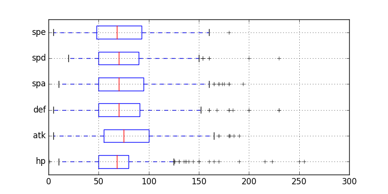
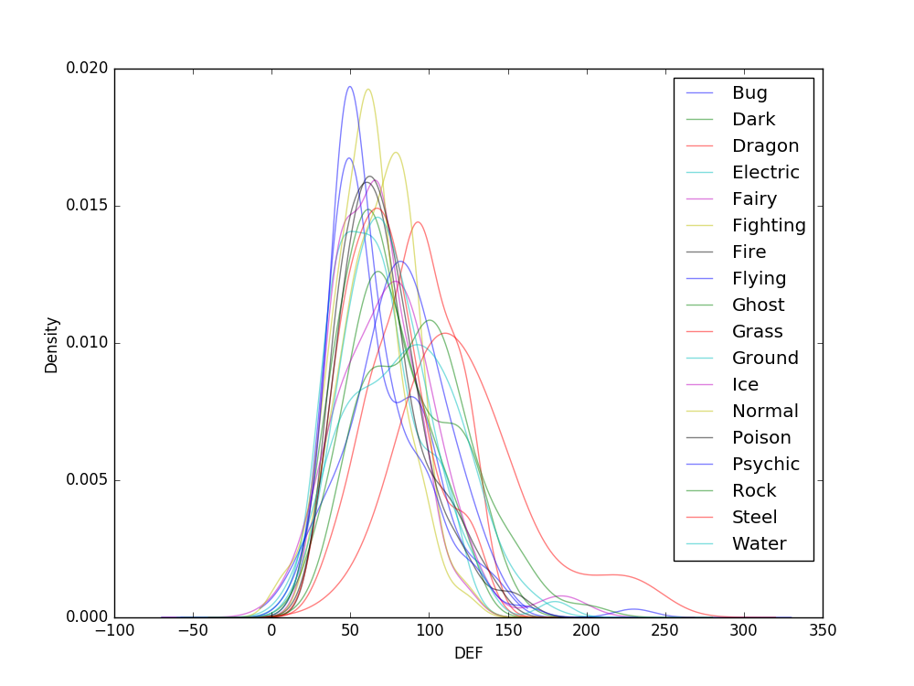
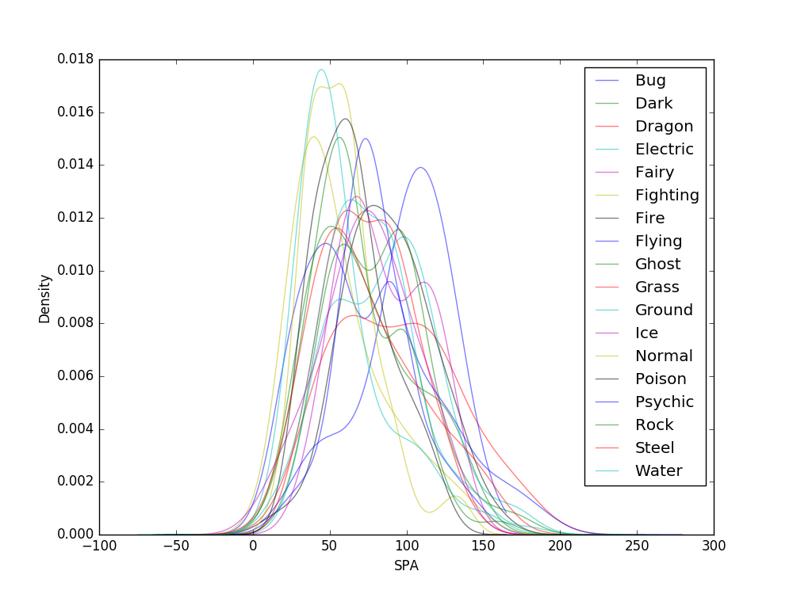
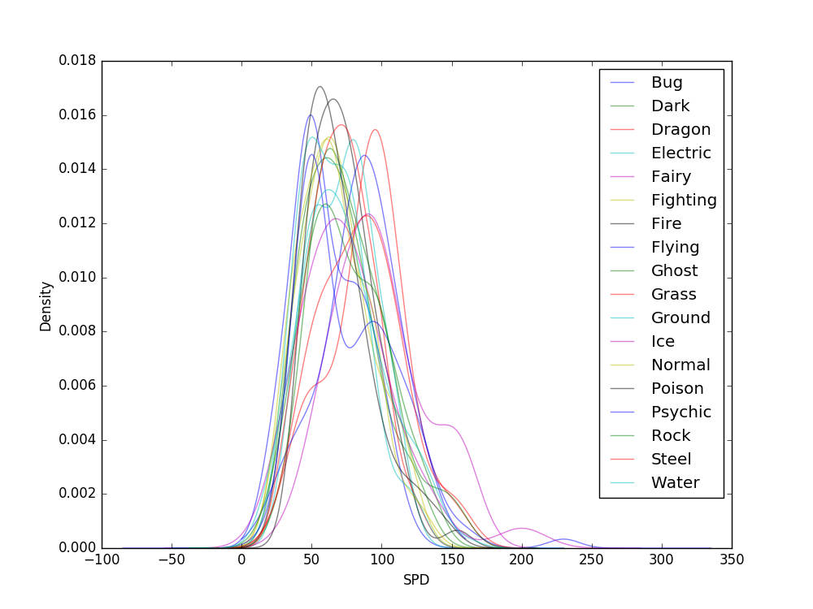
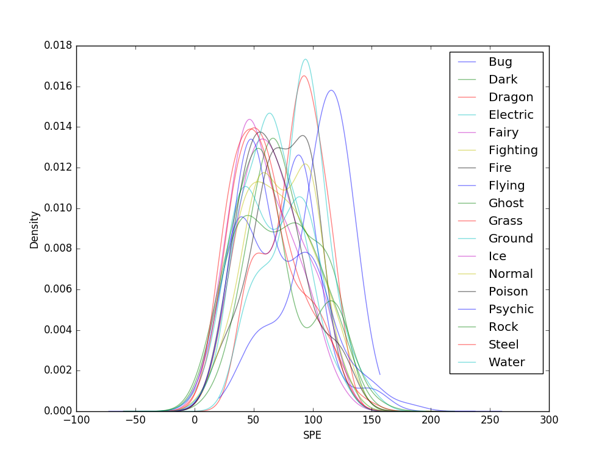
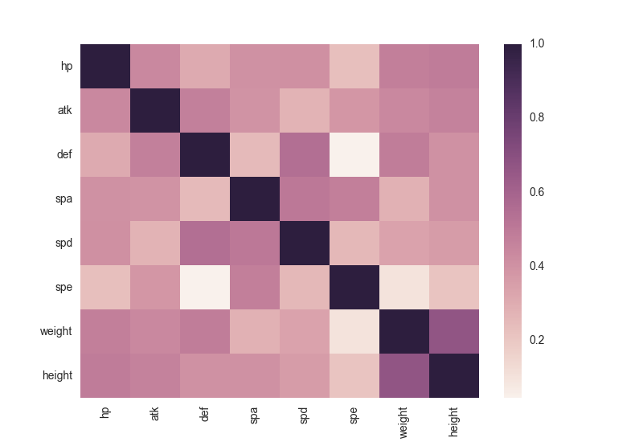

## Introdução

O objetivo deste trabalho é tentar classificar o tipo de um Pokémon baseado em seus atributos.

## Dataset

O dataset utilizado foi obtido do site [Kaggle](https://www.kaggle.com/mylesoneill/d/mylesoneill/pokemon-sun-and-moon-gen-7-stats/new-sun-and-moon-pokemon-analysis), e posteriormente filtrado para remover campos irrelevantes. Ele contém os seguitnes dados:

| Variável | Significado |
| --- | --- |
| type | Tipo do Pokémon |
| HP | Pontos de vida |
| ATK | Pontos de ataque físico |
| DEF | Pontos de defesa física |
| SPA | Pontos de ataque especial |
| SPD | Pontos de defesa especial |
| SPE | Pontos de velocidade |

## Análise exploratória

### Estatísticas preliminares

var | count | mean | std | min | 25% | 50% | 75% | max
--- | --- | --- | --- | --- | --- | --- | --- | --- | 
hp | 1061 | 70.041470 | 25.893508 | 1 | 50 | 68 | 80 | 255
atk | 1061 | 79.602262 | 31.378369 | 5 | 55 | 75 | 100 | 190
def | 1061 | 73.730443 | 30.394899 | 5 | 50 | 70 | 91 | 230
spa | 1061 | 74.550424 | 31.975146 | 1 | 50 | 70 | 95 | 194
spd | 1061 | 72.911404 | 27.995681 | 2 | 50 | 70 | 90 | 230
spe | 1061 | 70.321395 | 29.328288 | 5 | 48 | 68 | 93 | 180

Temos um total de 1061 Pokémon, contando formas diferentes como Pokémon diferentes. Podemos observar que os stats tem comportamentos bem similares, com uma média de 70 a 80, e desvio padrão na casa dos 30.

### Box plots

Nos box plots, podemos observar que grande parte dos stats se encontram entre 0 e 160 pontos, com alguns poucos registros com valores mais elevados até cerca de 220, e dois casos extremos pertencentes à Chansey e Blissey, com 250 e 255 HP, respectivamente.

### KDE

Para uma melhor visualização, optamos por plotar as estimativas de densidade kernel ao invés de histogramas. 

### Matriz de correlações

### Matriz de dispersão

